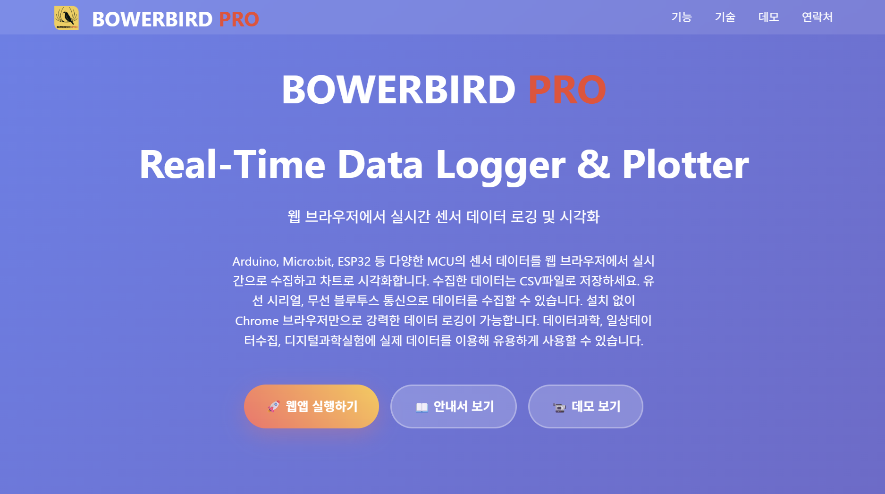

# 🐦 BOWERBIRD PRO (바우어버드 프로)

**BOWERBIRD PRO**는 아두이노(Arduino), 마이크로비트(Micro:bit), ESP32 등 다양한 MCU의 센서 데이터를 웹 브라우저에서 실시간으로 수집하고 시각화하는 웹 기반 데이터 로거입니다. 별도의 프로그램 설치 없이 Chrome 브라우저만 있으면 유선(Serial) 및 무선(Bluetooth LE) 연결을 통해 데이터를 기록하고 분석할 수 있습니다.



## 🌟 주요 기능 (Key Features)

*   **실시간 데이터 로깅 & 플로팅**: 들어오는 센서 데이터를 즉시 차트와 로그로 확인할 수 있습니다.
*   **다양한 연결 지원**:
    *   **Web Serial API**: USB 케이블을 통한 안정적인 고속 유선 통신.
    *   **Web Bluetooth API**: BLE(Bluetooth Low Energy)를 통한 편리한 무선 통신.
*   **고급 데이터 분석 도구**:
    *   **미적분 계산**: 토글 방식으로 각 센서 데이터의 미분(Derivative)과 적분(Integral)을 실시간 계산 및 시각화.
    *   **회귀 분석**: 5가지 모델(선형, 다항식, 지수, 거듭제곱, 로그) 지원으로 데이터 트렌드 분석 및 예측.
    *   **통계 분석**: 평균, 최소/최대값, 표준편차, 데이터 개수, 결정계수(R²) 자동 계산.
    *   **범위 선택 분석**: 차트를 드래그하여 특정 구간만 선택해 상세 분석 가능.
    *   **트렌드라인**: 회귀 모델에 따른 추세선을 차트에 오버레이하여 시각적 분석 지원.
*   **시각화 제어**:
    *   **줌 & 팬 컨트롤**: 1초/10초/1분 등 다양한 시간 스케일로 차트를 확대/축소하여 정밀 분석 가능.
    *   **이중 Y축**: 서로 다른 스케일의 데이터를 동시에 시각화(예: 온도와 습도).
    *   **자동 스크롤**: 실시간 데이터 로깅 시 차트가 자동으로 최신 데이터를 추적.
    *   **색상 구분**: 센서별, 미분/적분별로 고유한 색상 팔레트를 적용해 가독성 향상.
*   **데이터 관리**:
    *   **CSV 내보내기**: 수집된 데이터를 날짜, 시간, 센서값 열이 포함된 CSV 파일로 저장.
    *   **콘솔 로그**: 모든 이벤트와 수신 데이터를 시간순으로 기록.
*   **다국어 지원**: 한국어, 영어, 일본어, 중국어(간체/번체), 독일어, 스페인어, 프랑스어, 이탈리아어, 포르투갈어, 러시아어, 네덜란드어, 아랍어, 터키어, 페르시아어, 우즈베크어, 인도네시아어, 말레이어, 태국어, 베트남어, 타갈로그어 등 **21개 언어 지원**.
*   **고성능 처리**:
    *   비동기 데이터 버퍼링(50ms 간격) 및 분석 스로틀링(200ms 간격)으로 실시간 렉 없는 부드러운 동작.
    *   requestAnimationFrame 기반 최적화로 고속 데이터 전송 시에도 브라우저 프리징 방지.
*   **모듈형 아키텍처**: 통신, 시각화, 분석 모듈이 분리되어 유지보수 및 기능 확장 용이.

## 🛠 시스템 구조 (Folder Structure)

최신 리팩토링을 통해 유지보수와 확장성이 용이한 모듈형 구조로 개편되었습니다.

```text
boewrbirdpro/
├── index.html           # 메인 랜딩 페이지 (소개 및 진입점)
├── app.html             # 웹 애플리케이션 실행 페이지
├── information.html     # 사용자 매뉴얼 및 가이드
├── css/
│   └── style.css        # 통합 스타일시트
├── js/                  # 자바스크립트 소스 코드 (ES6 Modules)
│   ├── main.js          # 앱 진입점 및 로직 제어
│   ├── core/            # 통신 핵심 모듈
│   │   ├── serial.js    # 시리얼 통신 처리
│   │   └── ble.js       # 블루투스 통신 처리
│   ├── visualization/   # 시각화 모듈
│   │   └── chart-handler.js # Chart.js 제어, 이중 Y축, 줌 기능
│   ├── analysis/        # 데이터 분석 모듈
│   │   ├── analysis-ui.js    # 분석 UI 및 미적분 계산
│   │   ├── regression.js     # 회귀 분석 (5가지 모델)
│   │   ├── classification.js # 분류 분석
│   │   └── statistics.js     # 통계 계산
│   └── utils/           # 유틸리티
│       ├── i18n.js      # 다국어 처리 (21개 언어)
│       └── helpers.js   # 로깅, 포맷팅, 버퍼링 최적화
├── translations/        # 언어별 번역 파일 (.json)
└── assets/              # 이미지 및 정적 자원
    └── images/
```

## 💻 기술 스택 (Tech Stack)

*   **Frontend**: HTML5, CSS3, JavaScript (ES6+, Modules)
*   **Visualization**: [Chart.js](https://www.chartjs.org/), [chartjs-plugin-zoom](https://www.chartjs.org/chartjs-plugin-zoom/)
*   **Communication**: 
    *   [Web Serial API](https://developer.mozilla.org/en-US/docs/Web/API/Web_Serial_API)
    *   [Web Bluetooth API](https://developer.mozilla.org/en-US/docs/Web/API/Web_Bluetooth_API)
*   **Styling**: Vanilla CSS (Flexbox/Grid layout, Responsive design)

## 🚀 시작하기 (Getting Started)

### 실행 방법

이 프로젝트는 **ES6 모듈**을 사용하므로, 로컬 파일 시스템(`file://`)에서 직접 열면 CORS 정책으로 인해 작동하지 않을 수 있습니다.

1.  **로컬 웹 서버 사용 (권장)**:
    *   VS Code의 'Live Server' 확장 프로그램 등을 사용하여 `index.html` 또는 `app.html`을 실행하세요.

2.  **데이터 형식**:
    *   MCU(아두이노 등)에서 다음과 같은 형식으로 데이터를 전송해야 합니다:
    *   `값1,값2\n` (예: `25.5,60\n` - 온도 25.5, 습도 60)
    *   또는 `DATA,값1,값2\n`

### 주요 사용 팁

*   **미분/적분 분석**: 데이터 수집 중 미분/적분 버튼을 클릭하면 토글 방식으로 ON/OFF됩니다.
*   **회귀 분석**: 차트를 드래그하여 분석할 구간을 선택한 후, 원하는 회귀 모델을 선택하세요.
*   **성능 최적화**: 고속 데이터 전송 시 자동 버퍼링으로 끊김 없이 동작합니다(최대 50ms 지연).
*   **다국어 전환**: 상단 설정에서 21개 언어 중 선택 가능합니다.

## 👨‍💻 개발자 정보 (Developer)

*   **개발자**: 김석전 (Kim Seok Jeon / 송도중교사/인하대 겸임교수)
*   **연락처**: alphaco@kakao.com / doolbat@naver.com
*   **버전**: v2.0.0 (Advanced Analysis & Multilingual Edition)
*   **라이선스**: K-12 공교육용 무료 사용 가능

---
*Developed for Science Education & Data Science invstigation.*
